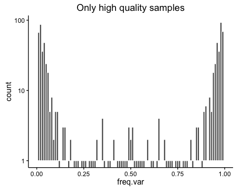

FluVacs Figures - Draft
================
Kari and JT
June 2, 2016

-   [Initial data processing](#initial-data-processing)
-   [Figure 3 Coverage plots](#figure-3-coverage-plots)
-   [Figure 5](#figure-5)
-   [Frequency of Variants](#frequency-of-variants)
    -   [SNV count per sample](#snv-count-per-sample)
-   [Table 4](#table-4)

Initial data processing
=======================

So after all that work we are left with all the samples (all seasons) in all.df and only those variants from high quality data in all.qual.df. This includes samples with &gt;105 genomes per microliter or &gt; 103 genomes per microliter but were sequenced in duplicate.

    ## The following `from` values were not present in `x`: Sample

Figure 3 Coverage plots
=======================

These are just from the first runs. I'm not including the duplicates here - should I? These have a sliding window of 100 with a step of 100 no overlap.

If we plot on a log scale the bars are well above 0.

    ## Scale for 'y' is already present. Adding another scale for 'y', which
    ## will replace the existing scale.

Figure 5
========

High quality is &gt;105 or &gt;103 sequenced in duplicate Currently I am making these plots with just the 2007-2008 samples. Once I have the meta data sorted for the other seasons it will be trivial to add them in.

Frequency of Variants
=====================

These are the variants between 1-99%. each bin is 1% wide. The y axis is log scaled which in ggplot leads to a problem when there are no observations (lines below axis). I can remove these before publication. 

SNV count per sample
--------------------

### iSNV

### Whole Genome

    ## `stat_bindot()` using `bins = 30`. Pick better value with `binwidth`.

#### High quality

    ## `stat_bindot()` using `bins = 30`. Pick better value with `binwidth`.

### HA NA

    ## `stat_bindot()` using `bins = 30`. Pick better value with `binwidth`.

#### High quality

    ## `stat_bindot()` using `bins = 30`. Pick better value with `binwidth`.

Table 4
=======

maybe these should be averages or ranges. All data

| chr    |     IIV|     LAIV|     PLACEBO|                                        NA|
|:-------|-------:|--------:|-----------:|-----------------------------------------:|
| HA     |     246|      710|         457|                                        48|
| M      |     135|      397|         229|                                         4|
| NP     |      89|      326|         178|                                        78|
| NS     |      49|      191|          89|                                         8|
| PA     |     204|      620|         358|                                        30|
| PB1    |     264|      841|         500|                                        76|
| PB2    |     293|      921|         551|                                        55|
| Not su |  re wha|  t the N|  A is we mu|  st be missing an intervention somewhere.|

High quality data

| chr |  IIV|  LAIV|  PLACEBO|
|:----|----:|-----:|--------:|
| HA  |   20|    25|       25|
| M   |    2|    12|       18|
| NP  |   11|    14|       13|
| NS  |    7|    15|       15|
| PA  |   36|   102|       75|
| PB1 |   16|    33|       25|
| PB2 |   45|   100|       69|
