FluVacs Figures - Draft
================
Kari and JT
May 2, 2016

-   [Initial data processing](#initial-data-processing)
-   [Frequency of Variants](#frequency-of-variants)
-   [Diversity measures](#diversity-measures)
    -   [SNV count per sample](#snv-count-per-sample)
    -   [Shannon's Entropy](#shannons-entropy)
-   [Heat map](#heat-map)

Initial data processing
=======================

``` r
# read in the csvs and add a season column to use later
titer.2004.5 <- read.csv("../Titers_status_2004-2005.csv", stringsAsFactors = F)
titer.2004.5$season <- "04-05"
titer.2005.6 <- read.csv("../Titers_status_2005-2006.csv", stringsAsFactors = F)
titer.2005.6$season <- "05-06"
titer.2007.8 <- read.csv("../Titers_status_2007-2008.csv", stringsAsFactors = F)
titer.2007.8$season <- "07-08"
```

``` r
var.2007.8 <- read.csv("../data/processed/Run_1293/Variants/all.sum.csv", stringsAsFactors = F)
x <- read.csv("../data/processed/Run_1304/Variants/all.sum.csv", stringsAsFactors = F)  # the rest of these samples
var.2007.8 <- rbind(var.2007.8, x)  # combine both runs
other.seasons <- read.csv("../data/processed/Run_1412/Variants/all.sum.csv", 
    stringsAsFactors = F)


var.2004.5.df <- processing(data.df = other.seasons, meta.df = titer.2004.5, 
    pval = 0.01, phred = 35, mapq = 30, read_cut = c(32, 94))

var.2004.5.df <- subset(var.2004.5.df, season == "04-05")
var.2005.6.df <- processing(data.df = other.seasons, meta.df = titer.2005.6, 
    pval = 0.01, phred = 35, mapq = 30, read_cut = c(32, 94))
var.2005.6.df <- subset(var.2004.5.df, season == "05-06")

var.2007.8.df <- processing(data.df = var.2007.8, meta.df = titer.2007.8, pval = 0.01, 
    phred = 35, mapq = 30, read_cut = c(32, 94))

all.df <- rbind(var.2004.5.df, var.2005.6.df)
all.df <- rbind(all.df, var.2007.8.df)

all.df <- subset(all.df, freq.var > 0.005)
##### Now for the duplicate runs #######

var.2004.5.df2 <- read.csv("../data/processed/2004_2005/Variants/all.sum.csv", 
    stringsAsFactors = F)
var.2004.5.df2 <- processing(data.df = var.2004.5.df2, meta.df = titer.2004.5, 
    pval = 0.01, phred = 35, mapq = 30, read_cut = c(32, 94))

var.2005.6.df2 <- read.csv("../data/processed/2005-2006/Variants/all.sum.csv", 
    stringsAsFactors = F)
var.2005.6.df2 <- processing(data.df = var.2005.6.df2, meta.df = titer.2005.6, 
    pval = 0.01, phred = 35, mapq = 30, read_cut = c(32, 94))

var.2007.8.df2 <- read.csv("../data/processed/2007-2008/Variants/all.sum.csv", 
    stringsAsFactors = F)
var.2007.8.df2 <- processing(data.df = var.2007.8.df2, meta.df = titer.2007.8, 
    pval = 0.01, phred = 35, mapq = 30, read_cut = c(32, 94))

### Join duplicates #####

dups.2004.5 <- join_dups(data1.df = var.2004.5.df, data2.df = var.2004.5.df2)
dups.2005.6 <- join_dups(data1.df = var.2005.6.df, data2.df = var.2005.6.df2)
dups.2007.8 <- join_dups(data1.df = var.2007.8.df, data2.df = var.2007.8.df2)

##### Merge duplicates with intial data that was >1e5

qual.2004.5 <- high_qual(data1.df = var.2004.5.df, dups.df = dups.2004.5, titer = 1000)  # only duplicates above 1e3 kept
qual.2005.6 <- high_qual(data1.df = var.2005.6.df, dups.df = dups.2005.6, titer = 1000)
qual.2007.8 <- high_qual(data1.df = var.2007.8.df, dups.df = dups.2007.8, titer = 1000)
all.qual.df <- rbind(qual.2004.5, qual.2005.6)
all.qual.df <- rbind(all.qual.df, qual.2007.8)

all.qual.df <- subset(all.qual.df, freq.var > 0.005)
```

So after all that work we are left with all the samples (all seasons) in all.df and only those variants from high quality data in all.qual.df. This includes samples with &gt;10<sup>5</sup> genomes per microliter or &gt; 10<sup>3</sup> genomes per microliter but were sequenced in duplicate.

> The notes about NAs being produced is a little concerning. I'll look into it later. My hunch is some of the samples from that were sequenced were not included in the meta data

Frequency of Variants
=====================

``` r
ggplot(subset(all.df, freq.var < 0.9), aes(x = freq.var)) + geom_histogram(color = "white") + 
    scale_x_log10() + ggtitle("All samples")
```

    ## `stat_bin()` using `bins = 30`. Pick better value with `binwidth`.

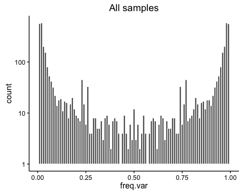

``` r
ggplot(subset(all.qual.df, freq.var < 0.9), aes(x = freq.var)) + geom_histogram(color = "white") + 
    scale_x_log10() + ggtitle("Only high quality samples")
```

    ## `stat_bin()` using `bins = 30`. Pick better value with `binwidth`.

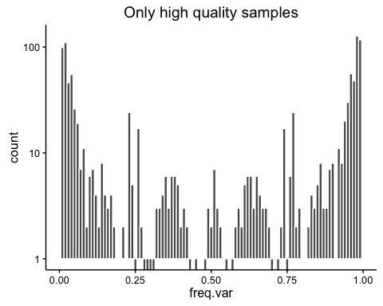

Diversity measures
==================

SNV count per sample
--------------------

``` r
count_muts <- function(data.df) {
    ddply(data.df, ~Lauring_Id + Vax + season, function(x) dim(x)[1])
}

all.snv <- count_muts(all.df)
qual.snv <- count_muts(all.qual.df)
```

### Whole genome

#### all data

``` r
ggplot(data = subset(all.snv, !is.na(Vax)), aes(y = V1, x = Vax)) + geom_dotplot(stackdir = "center", 
    binaxis = "y") + ylab("Number of SNV")
```

    ## `stat_bindot()` using `bins = 30`. Pick better value with `binwidth`.

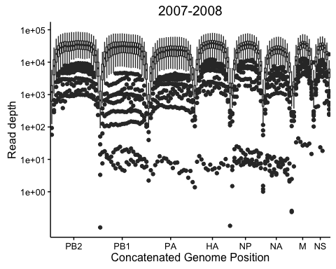

#### High quality

``` r
ggplot(data = subset(qual.snv, !is.na(Vax)), aes(y = V1, x = Vax)) + geom_dotplot(stackdir = "center", 
    binaxis = "y") + ylab("Number of SNV")
```

    ## `stat_bindot()` using `bins = 30`. Pick better value with `binwidth`.


### HA NA

#### all data

``` r
all.snv <- count_muts(subset(all.df, chr %in% c("HA", "N_A", "NR")))
ggplot(data = subset(all.snv, !is.na(Vax)), aes(y = V1, x = Vax)) + geom_dotplot(stackdir = "center", 
    binaxis = "y") + ylab("Number of SNV")
```

    ## `stat_bindot()` using `bins = 30`. Pick better value with `binwidth`.


#### High quality

``` r
qual.snv <- count_muts(subset(all.qual.df, chr %in% c("HA", "N_A", "NR")))

ggplot(data = subset(qual.snv, !is.na(Vax)), aes(y = V1, x = Vax)) + geom_dotplot(stackdir = "center", 
    binaxis = "y") + ylab("Number of SNV")
```

    ## `stat_bindot()` using `bins = 30`. Pick better value with `binwidth`.


### Anitigenic sites

``` r
Ha_antigenic <- function(df) {
    non_coding <- 29
    
    df <- mutate(df, coding_pos = pos - non_coding, AA_pos = (coding_pos - 1)%/%3 + 
        1)
    
    
    df$antigenic <- F
    antigenic_sites <- c(48, 53, 62, 63, 78, 83, 84, 91, 94, 122, 128, 137, 
        138, 140, 142, 144, 145, 156, 157, 159, 160, 168, 171, 186, 192, 198, 
        207, 208, 213, 214, 219, 226, 261, 278, 279, 309, 311, 312)
    df$antigenic[df$chr == "HA" & df$AA_pos %in% antigenic_sites] <- T
    return(df)
}


all.df <- Ha_antigenic(all.df)

all.df.counts <- count_muts(subset(all.df, antigenic == T))

ggplot(data = subset(all.df.counts, !is.na(Vax)), aes(y = V1, x = Vax)) + geom_dotplot(stackdir = "center", 
    binaxis = "y") + ylab("Number of SNV") + ggtitle("all samples")
```

    ## `stat_bindot()` using `bins = 30`. Pick better value with `binwidth`.


``` r
all.qual.df <- Ha_antigenic(all.qual.df)

all.qual.df.counts <- count_muts(subset(all.qual.df, antigenic == T))
ggplot(data = subset(all.qual.df.counts, !is.na(Vax)), aes(y = V1, x = Vax)) + 
    geom_dotplot(stackdir = "center", binaxis = "y") + ylab("Number of SNV") + 
    ggtitle("quality samples")
```

    ## `stat_bindot()` using `bins = 30`. Pick better value with `binwidth`.

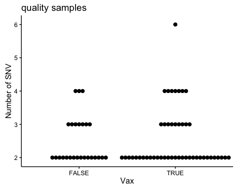

Shannon's Entropy
-----------------

For the entropy calculations I am assuming 39000 potential variants. This is not right but probably close enough. It is just used to normalize the data. In the future we can use the fasta reference files to get the exact number.

### Whole genome

``` r
possible_vars <- 3900  # fix to be accurate

H <- function(x) {
    x <- subset(x, freq.var < 0.9)
    H_pos <- ddply(x, ~chr + pos, summarize, wt = 1 - sum(freq.var), H = -sum(c(freq.var * 
        log(freq.var), wt * log(wt))))
    sum(H_pos$H)/(possible_vars/3)
}

all.H <- ddply(all.df, ~Lauring_Id + Vax + season, H)

ggplot(data = subset(all.H), aes(y = V1, x = Vax)) + geom_dotplot(stackdir = "center", 
    binaxis = "y") + ylab("Shannon's Entropy") + scale_y_log10() + ggtitle("all samples")
```

    ## `stat_bindot()` using `bins = 30`. Pick better value with `binwidth`.

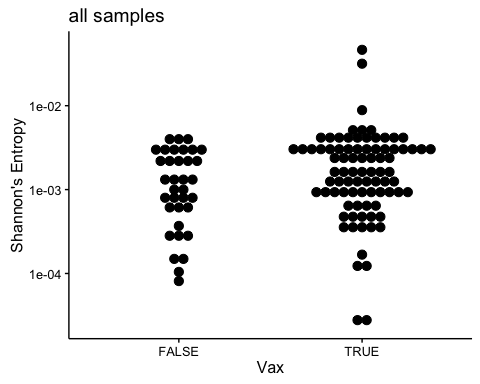

``` r
qual.H <- ddply(all.qual.df, ~Lauring_Id + Vax + season, H)
ggplot(data = subset(qual.H), aes(y = V1, x = Vax)) + geom_dotplot(stackdir = "center", 
    binaxis = "y") + ylab("Shannon's Entropy") + scale_y_log10() + ggtitle("quality samples")
```

    ## `stat_bindot()` using `bins = 30`. Pick better value with `binwidth`.

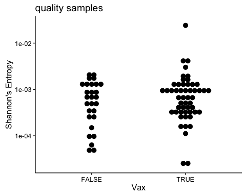

### HA NA

``` r
all.HA.NA.H <- ddply(subset(all.df, chr %in% c("HA", "N_A", "NR")), ~Lauring_Id + 
    Vax + season, H)

ggplot(data = subset(all.HA.NA.H), aes(y = V1, x = Vax)) + geom_dotplot(stackdir = "center", 
    binaxis = "y") + ylab("Shannon's Entropy") + scale_y_log10() + ggtitle("all samples")
```

    ## `stat_bindot()` using `bins = 30`. Pick better value with `binwidth`.

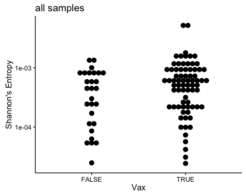

``` r
qual.HA.NA.H <- ddply(subset(all.qual.df, chr %in% c("HA", "N_A", "NR")), ~Lauring_Id + 
    Vax + season, H)
ggplot(data = subset(qual.H), aes(y = V1, x = Vax)) + geom_dotplot(stackdir = "center", 
    binaxis = "y") + ylab("Shannon's Entropy") + scale_y_log10() + ggtitle("quality samples")
```

    ## `stat_bindot()` using `bins = 30`. Pick better value with `binwidth`.

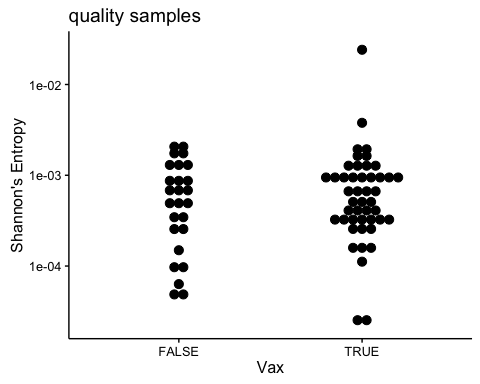

### Anitigenic sites

``` r
all.ant.H <- ddply(subset(all.df, antigenic == T), ~Lauring_Id + Vax + season, 
    H)

ggplot(data = subset(all.ant.H), aes(y = V1, x = Vax)) + geom_dotplot(stackdir = "center", 
    binaxis = "y") + ylab("Shannon's Entropy") + scale_y_log10() + ggtitle("all samples")
```

    ## `stat_bindot()` using `bins = 30`. Pick better value with `binwidth`.

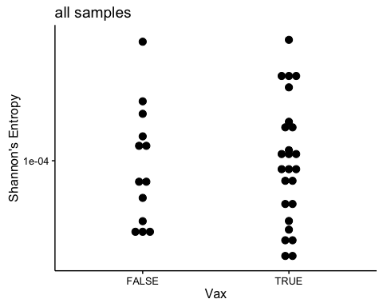

``` r
qual.ant.H <- ddply(subset(all.qual.df, antigenic == T), ~Lauring_Id + Vax + 
    season, H)

ggplot(data = subset(qual.ant.H), aes(y = V1, x = Vax)) + geom_dotplot(stackdir = "center", 
    binaxis = "y") + ylab("Shannon's Entropy") + scale_y_log10() + ggtitle("quality samples")
```

    ## `stat_bindot()` using `bins = 30`. Pick better value with `binwidth`.

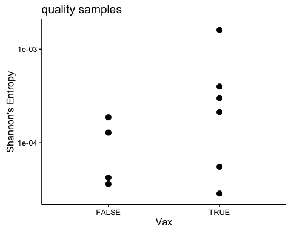

Heat map
========

Theses are made with the quality samples

``` r
make_heat_map(subset(all.qual.df, season == "07-08"))
```

    ## Aggregation function missing: defaulting to length

    ##    mutation      variable value segment
    ## 1 PB2_A182G 07-08.79.TRUE    -1     PB2
    ## 2 PB2_G186A 07-08.79.TRUE    -1     PB2
    ## 3 PB2_T201C 07-08.79.TRUE    -1     PB2
    ## 4 PB2_G204A 07-08.79.TRUE    -1     PB2
    ## 5 PB2_G209A 07-08.79.TRUE    -1     PB2
    ## 6 PB2_G220A 07-08.79.TRUE    -1     PB2

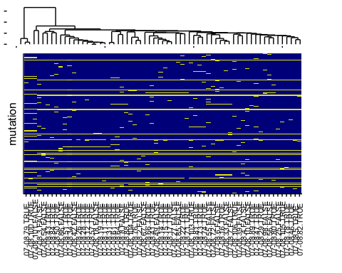

``` r
make_heat_map(subset(all.qual.df, season == "04-05"))
```

    ##    mutation       variable     value segment
    ## 1  PB2_G96A 04-05.402.TRUE -1.000000     PB2
    ## 2 PB2_T249C 04-05.402.TRUE -1.000000     PB2
    ## 3 PB2_A316G 04-05.402.TRUE  1.998882     PB2
    ## 4 PB2_C462T 04-05.402.TRUE -1.000000     PB2
    ## 5 PB2_C465T 04-05.402.TRUE  1.999526     PB2
    ## 6 PB2_A486G 04-05.402.TRUE -1.000000     PB2

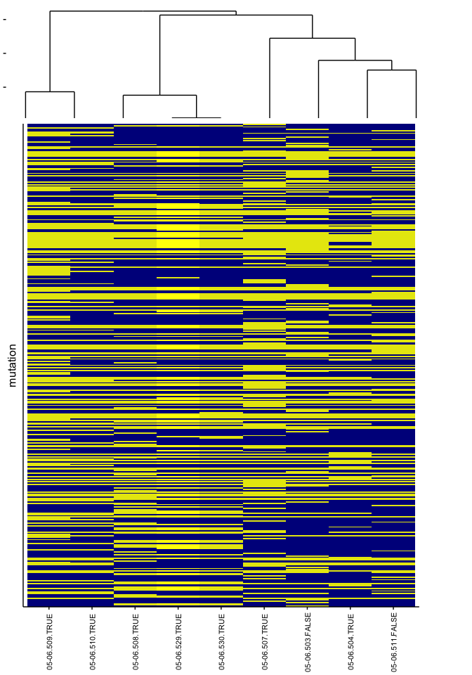
