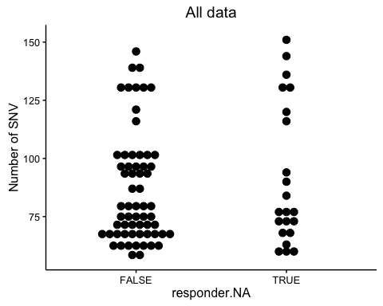
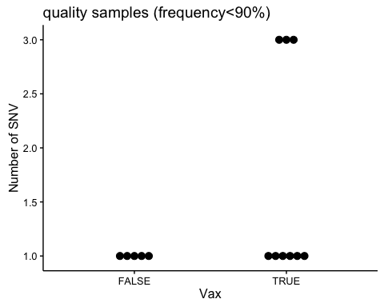

FluVacs Figures - Draft
================
Kari and JT
May 2, 2016

-   [Initial data processing](#initial-data-processing)
-   [Frequency of Variants](#frequency-of-variants)
-   [Diversity measures](#diversity-measures)
    -   [SNV count per sample](#snv-count-per-sample)
    -   [Shannon's Entropy](#shannons-entropy)
-   [Heat map](#heat-map)
-   [Antigenic Sites](#antigenic-sites)
    -   [All data](#all-data-2)
    -   [High quality](#high-quality-2)

Initial data processing
=======================

``` r
# read in the csvs and add a season column to use later
titer.2004.5 <- read.csv("../Titers_status_2004-2005.csv", stringsAsFactors = F)
titer.2004.5$season <- "04-05"
titer.2005.6 <- read.csv("../Titers_status_2005-2006.csv", stringsAsFactors = F)
titer.2005.6$season <- "05-06"
titer.2007.8 <- read.csv("../Titers_status_2007-2008.csv", stringsAsFactors = F)
titer.2007.8$season <- "07-08"
```

``` r
var.2007.8 <- read.csv("../data/processed/Run_1293/Variants/all.sum.csv", stringsAsFactors = F)
x <- read.csv("../data/processed/Run_1304/Variants/all.sum.csv", stringsAsFactors = F)  # the rest of these samples
var.2007.8 <- rbind(var.2007.8, x)  # combine both runs
other.seasons <- read.csv("../data/processed/Run_1412/Variants/all.sum.csv", 
    stringsAsFactors = F)


var.2004.5.df <- processing(data.df = other.seasons, meta.df = titer.2004.5, 
    pval = 0.01, phred = 35, mapq = 30, read_cut = c(32, 94))

var.2004.5.df <- subset(var.2004.5.df, season == "04-05")
var.2005.6.df <- processing(data.df = other.seasons, meta.df = titer.2005.6, 
    pval = 0.01, phred = 35, mapq = 30, read_cut = c(32, 94))
var.2005.6.df <- subset(var.2005.6.df, season == "05-06")

var.2007.8.df <- processing(data.df = var.2007.8, meta.df = titer.2007.8, pval = 0.01, 
    phred = 35, mapq = 30, read_cut = c(32, 94))

all.df <- rbind(var.2004.5.df, var.2005.6.df)
all.df <- rbind(all.df, var.2007.8.df)

all.df <- subset(all.df, freq.var > 0.005)
##### Now for the duplicate runs #######

var.2004.5.df2 <- read.csv("../data/processed/2004_2005/Variants/all.sum.csv", 
    stringsAsFactors = F)
var.2004.5.df2 <- processing(data.df = var.2004.5.df2, meta.df = titer.2004.5, 
    pval = 0.01, phred = 35, mapq = 30, read_cut = c(32, 94))

var.2005.6.df2 <- read.csv("../data/processed/2005-2006/Variants/all.sum.csv", 
    stringsAsFactors = F)
var.2005.6.df2 <- processing(data.df = var.2005.6.df2, meta.df = titer.2005.6, 
    pval = 0.01, phred = 35, mapq = 30, read_cut = c(32, 94))

var.2007.8.df2 <- read.csv("../data/processed/2007-2008/Variants/all.sum.csv", 
    stringsAsFactors = F)
var.2007.8.df2 <- processing(data.df = var.2007.8.df2, meta.df = titer.2007.8, 
    pval = 0.01, phred = 35, mapq = 30, read_cut = c(32, 94))

### Join duplicates #####

dups.2004.5 <- join_dups(data1.df = var.2004.5.df, data2.df = var.2004.5.df2)
dups.2005.6 <- join_dups(data1.df = var.2005.6.df, data2.df = var.2005.6.df2)
dups.2007.8 <- join_dups(data1.df = var.2007.8.df, data2.df = var.2007.8.df2)

##### Merge duplicates with intial data that was >1e5

qual.2004.5 <- high_qual(data1.df = var.2004.5.df, dups.df = dups.2004.5, titer = 1000)  # only duplicates above 1e3 kept
qual.2005.6 <- high_qual(data1.df = var.2005.6.df, dups.df = dups.2005.6, titer = 1000)
qual.2007.8 <- high_qual(data1.df = var.2007.8.df, dups.df = dups.2007.8, titer = 1000)
all.qual.df <- rbind(qual.2004.5, qual.2005.6)
all.qual.df <- rbind(all.qual.df, qual.2007.8)

all.qual.df <- subset(all.qual.df, freq.var > 0.005)
```

So after all that work we are left with all the samples (all seasons) in all.df and only those variants from high quality data in all.qual.df. This includes samples with &gt;10<sup>5</sup> genomes per microliter or &gt; 10<sup>3</sup> genomes per microliter but were sequenced in duplicate.

> The notes about NAs being produced is a little concerning. I'll look into it later. My hunch is some of the samples from that were sequenced were not included in the meta data

Frequency of Variants
=====================

``` r
ggplot(subset(all.df, freq.var < 0.9), aes(x = freq.var)) + geom_histogram(color = "white") + 
    scale_x_log10() + ggtitle("All samples")
```

    ## `stat_bin()` using `bins = 30`. Pick better value with `binwidth`.


``` r
ggplot(subset(all.qual.df, freq.var < 0.9), aes(x = freq.var)) + geom_histogram(color = "white") + 
    scale_x_log10() + ggtitle("Only high quality samples")
```

    ## `stat_bin()` using `bins = 30`. Pick better value with `binwidth`.


Diversity measures
==================

SNV count per sample
--------------------

``` r
count_muts <- function(data.df) {
    ddply(data.df, ~Lauring_Id + Vax + season, function(x) dim(x)[1])
}

all.snv <- count_muts(all.df)
qual.snv <- count_muts(all.qual.df)
```

### Whole genome

#### all data

``` r
ggplot(data = subset(all.snv, !is.na(Vax)), aes(y = V1, x = Vax)) + geom_dotplot(stackdir = "center", 
    binaxis = "y") + ylab("Number of SNV")
```

    ## `stat_bindot()` using `bins = 30`. Pick better value with `binwidth`.


#### High quality

``` r
ggplot(data = subset(qual.snv, !is.na(Vax)), aes(y = V1, x = Vax)) + geom_dotplot(stackdir = "center", 
    binaxis = "y", dotsize = 0.7) + ylab("Number of SNV")
```

    ## `stat_bindot()` using `bins = 30`. Pick better value with `binwidth`.


### HA NA

#### all data

``` r
all.snv <- count_muts(subset(all.df, chr %in% c("HA", "N_A", "NR")))
ggplot(data = subset(all.snv, !is.na(Vax)), aes(y = V1, x = Vax)) + geom_dotplot(stackdir = "center", 
    binaxis = "y") + ylab("Number of SNV")
```

    ## `stat_bindot()` using `bins = 30`. Pick better value with `binwidth`.


#### High quality

``` r
qual.snv <- count_muts(subset(all.qual.df, chr %in% c("HA", "N_A", "NR")))

ggplot(data = subset(qual.snv, !is.na(Vax)), aes(y = V1, x = Vax)) + geom_dotplot(stackdir = "center", 
    binaxis = "y") + ylab("Number of SNV")
```

    ## `stat_bindot()` using `bins = 30`. Pick better value with `binwidth`.


### Anitigenic sites

``` r
Ha_antigenic <- function(df) {
    # non_coding<-29
    
    df <- mutate(df, AA_pos = (pos - 1)%/%3 + 1)
    
    
    df$antigenic <- F
    antigenic_sites <- c(122, 124, 126, 130, 131, 132, 133, 135, 137, 138, 140, 
        142, 143, 144, 145, 146, 150, 152, 168, 128, 129, 155, 156, 157, 158, 
        159, 160, 163, 164, 165, 186, 187, 188, 189, 190, 192, 193, 194, 196, 
        197, 198, 44, 45, 46, 47, 48, 50, 51, 53, 54, 273, 275, 276, 278, 279, 
        280, 294, 297, 299, 300, 304, 305, 307, 308, 309, 310, 311, 312, 96, 
        102, 103, 117, 121, 167, 170, 171, 172, 173, 174, 175, 176, 177, 179, 
        182, 201, 203, 207, 208, 209, 212, 213, 214, 215, 216, 217, 218, 219, 
        226, 227, 228, 229, 230, 238, 240, 242, 246, 247, 248, 57, 59, 62, 63, 
        67, 75, 78, 80, 81, 82, 83, 86, 87, 88, 91, 92, 94, 109, 260, 261, 262, 
        265)
    AA_anti <- antigenic_sites + 17
    # antigenic sites: Site A:
    # 122,124,126,130,131,132,133,135,137,138,140,142,143,144,145,146,150,152,168
    # Site B:
    # 128,129,155,156,157,158,159,160,163,164,165,186,187,188,189,190,192,193,194,196,197,198
    # Site C:
    # 44,45,46,47,48,50,51,53,54,273,275,276,278,279,280,294,297,299,300,304,305,307,308,309,310,311,312
    # Site D:
    # 96,102,103,117,121,167,170,171,172,173,174,175,176,177,179,182,201,203,207,208,209,212,213,214,215,216,217,218,219,226,227,228,229,230,238,240,242,246,247,248
    # Site E:
    # 57,59,62,63,67,75,78,80,81,82,83,86,87,88,91,92,94,109,260,261,262,265 All
    # sites:
    # 122,124,126,130,131,132,133,135,137,138,140,142,143,144,145,146,150,152,168,128,129,155,156,157,158,159,160,163,164,165,186,187,188,189,190,192,193,194,196,197,198,44,45,46,47,48,50,51,53,54,273,275,276,278,279,280,294,297,299,300,304,305,307,308,309,310,311,312,96,102,103,117,121,167,170,171,172,173,174,175,176,177,179,182,201,203,207,208,209,212,213,214,215,216,217,218,219,226,227,228,229,230,238,240,242,246,247,248,57,59,62,63,67,75,78,80,81,82,83,86,87,88,91,92,94,109,260,261,262,265
    # Cluster Transitions: 145,155,156,158,159,189,193
    
    
    
    df$antigenic[df$chr == "HA" & df$AA_pos %in% AA_anti] <- T
    return(df)
}


all.df <- Ha_antigenic(all.df)

all.df.counts <- count_muts(subset(all.df, antigenic == T))

ggplot(data = subset(all.df.counts, !is.na(Vax)), aes(y = V1, x = Vax)) + geom_dotplot(stackdir = "center", 
    binaxis = "y", dotsize = 0.8) + ylab("Number of SNV") + ggtitle("all samples")
```

    ## `stat_bindot()` using `bins = 30`. Pick better value with `binwidth`.


``` r
all.qual.df <- Ha_antigenic(all.qual.df)

all.qual.df.counts <- count_muts(subset(all.qual.df, antigenic == T))
ggplot(data = subset(all.qual.df.counts, !is.na(Vax)), aes(y = V1, x = Vax)) + 
    geom_dotplot(stackdir = "center", binaxis = "y", dotsize = 0.8) + ylab("Number of SNV") + 
    ggtitle("quality samples")
```

    ## `stat_bindot()` using `bins = 30`. Pick better value with `binwidth`.


``` r
all.df.counts <- count_muts(subset(all.df, antigenic == T & freq.var < 0.9))

ggplot(data = subset(all.df.counts), aes(y = V1, x = Vax)) + geom_dotplot(stackdir = "center", 
    binaxis = "y") + ylab("Number of SNV") + ggtitle("all samples frequency<90%")
```

    ## `stat_bindot()` using `bins = 30`. Pick better value with `binwidth`.



``` r
all.qual.df.counts <- count_muts(subset(all.qual.df, antigenic == T & freq.var < 
    0.9))
ggplot(data = subset(all.qual.df.counts), aes(y = V1, x = Vax)) + geom_dotplot(stackdir = "center", 
    binaxis = "y") + ylab("Number of SNV") + ggtitle("quality samples (frequency<90%)")
```

    ## `stat_bindot()` using `bins = 30`. Pick better value with `binwidth`.



Shannon's Entropy
-----------------

For the entropy calculations I am assuming 39000 potential variants. This is not right but probably close enough. It is just used to normalize the data. In the future we can use the fasta reference files to get the exact number.

### Whole genome

``` r
possible_vars <- 3900  # fix to be accurate

H <- function(x) {
    x <- subset(x, freq.var < 0.9)
    H_pos <- ddply(x, ~chr + pos, summarize, wt = 1 - sum(freq.var), H = -sum(c(freq.var * 
        log(freq.var), wt * log(wt))))
    sum(H_pos$H)/(possible_vars/3)
}

all.H <- ddply(all.df, ~Lauring_Id + Vax + season, H)

ggplot(data = subset(all.H), aes(y = V1, x = Vax)) + geom_dotplot(stackdir = "center", 
    binaxis = "y") + ylab("Shannon's Entropy") + scale_y_log10() + ggtitle("all samples")
```

    ## `stat_bindot()` using `bins = 30`. Pick better value with `binwidth`.


``` r
qual.H <- ddply(all.qual.df, ~Lauring_Id + Vax + season, H)
ggplot(data = subset(qual.H), aes(y = V1, x = Vax)) + geom_dotplot(stackdir = "center", 
    binaxis = "y") + ylab("Shannon's Entropy") + scale_y_log10() + ggtitle("quality samples")
```

    ## `stat_bindot()` using `bins = 30`. Pick better value with `binwidth`.


### HA NA

``` r
all.HA.NA.H <- ddply(subset(all.df, chr %in% c("HA", "N_A", "NR")), ~Lauring_Id + 
    Vax + season, H)

ggplot(data = subset(all.HA.NA.H), aes(y = V1, x = Vax)) + geom_dotplot(stackdir = "center", 
    binaxis = "y") + ylab("Shannon's Entropy") + scale_y_log10() + ggtitle("all samples")
```

    ## `stat_bindot()` using `bins = 30`. Pick better value with `binwidth`.


``` r
qual.HA.NA.H <- ddply(subset(all.qual.df, chr %in% c("HA", "N_A", "NR")), ~Lauring_Id + 
    Vax + season, H)
ggplot(data = subset(qual.H), aes(y = V1, x = Vax)) + geom_dotplot(stackdir = "center", 
    binaxis = "y") + ylab("Shannon's Entropy") + scale_y_log10() + ggtitle("quality samples")
```

    ## `stat_bindot()` using `bins = 30`. Pick better value with `binwidth`.


### Anitigenic sites

``` r
all.ant.H <- ddply(subset(all.df, antigenic == T), ~Lauring_Id + Vax + season, 
    H)

ggplot(data = subset(all.ant.H), aes(y = V1, x = Vax)) + geom_dotplot(stackdir = "center", 
    binaxis = "y") + ylab("Shannon's Entropy") + scale_y_log10() + ggtitle("all samples")
```

    ## `stat_bindot()` using `bins = 30`. Pick better value with `binwidth`.


``` r
qual.ant.H <- ddply(subset(all.qual.df, antigenic == T), ~Lauring_Id + Vax + 
    season, H)

ggplot(data = subset(qual.ant.H), aes(y = V1, x = Vax)) + geom_dotplot(stackdir = "center", 
    binaxis = "y") + ylab("Shannon's Entropy") + scale_y_log10() + ggtitle("quality samples")
```

    ## `stat_bindot()` using `bins = 30`. Pick better value with `binwidth`.


Heat map
========

Theses are made with the quality samples

``` r
make_heat_map(subset(all.qual.df, season == "07-08"))
```

    ## Aggregation function missing: defaulting to length

    ##    mutation      variable value segment
    ## 1 PB2_A182G 07-08.79.TRUE    -1     PB2
    ## 2 PB2_G186A 07-08.79.TRUE    -1     PB2
    ## 3 PB2_T201C 07-08.79.TRUE    -1     PB2
    ## 4 PB2_G204A 07-08.79.TRUE    -1     PB2
    ## 5 PB2_G209A 07-08.79.TRUE    -1     PB2
    ## 6 PB2_G220A 07-08.79.TRUE    -1     PB2


``` r
make_heat_map(subset(all.qual.df, season == "05-06"))
```

    ## Aggregation function missing: defaulting to length

    ##    mutation       variable value segment
    ## 1  PB2_G96A 05-06.509.TRUE    -1     PB2
    ## 2 PB2_C191T 05-06.509.TRUE    -1     PB2
    ## 3 PB2_A225G 05-06.509.TRUE    -1     PB2
    ## 4 PB2_G236A 05-06.509.TRUE    -1     PB2
    ## 5 PB2_A264G 05-06.509.TRUE    -1     PB2
    ## 6 PB2_G282A 05-06.509.TRUE    -1     PB2


``` r
make_heat_map(subset(all.qual.df, season == "04-05"))
```

    ##    mutation       variable     value segment
    ## 1  PB2_G96A 04-05.402.TRUE -1.000000     PB2
    ## 2 PB2_T249C 04-05.402.TRUE -1.000000     PB2
    ## 3 PB2_A316G 04-05.402.TRUE  1.998882     PB2
    ## 4 PB2_C462T 04-05.402.TRUE -1.000000     PB2
    ## 5 PB2_C465T 04-05.402.TRUE  1.999526     PB2
    ## 6 PB2_A486G 04-05.402.TRUE -1.000000     PB2


Antigenic Sites
===============

### All data

``` r
# kable(subset(all.df,antigenic==T & season=='07-08',
# select=c(Lauring_Id,mutation,freq.var,AA_Pos)))
```

### High quality

``` r
x <- Ha_antigenic(qual.2007.8)

kable(subset(x, antigenic == T & season == "07-08", select = c(Lauring_Id, mutation, 
    freq.var, AA_pos)))
```

|       |  Lauring\_Id| mutation  |   freq.var|  AA\_pos|
|-------|------------:|:----------|----------:|--------:|
| 1500  |           34| HA\_A565C |  0.9980709|      189|
| 1501  |           34| HA\_C629T |  0.9973801|      210|
| 1502  |           34| HA\_C729T |  0.9974668|      243|
| 72    |           10| HA\_A565C |  0.9983945|      189|
| 73    |           10| HA\_A688G |  0.0344225|      230|
| 77    |           10| HA\_C629T |  0.9970229|      210|
| 78    |           10| HA\_C729T |  0.9972878|      243|
| 79    |           10| HA\_C732T |  0.0335238|      244|
| 139   |          100| HA\_A297T |  0.9959462|       99|
| 140   |          100| HA\_A567T |  0.9964438|      189|
| 142   |          100| HA\_C629T |  0.9972223|      210|
| 143   |          100| HA\_C729T |  0.9979950|      243|
| 150   |          100| HA\_T518C |  0.9957175|      173|
| 215   |          101| HA\_A297T |  0.9980548|       99|
| 216   |          101| HA\_A567T |  0.9983133|      189|
| 218   |          101| HA\_C629T |  0.9973626|      210|
| 219   |          101| HA\_C729T |  0.9980558|      243|
| 226   |          101| HA\_T518C |  0.9981249|      173|
| 290   |          103| HA\_A565C |  0.9988935|      189|
| 294   |          103| HA\_C629T |  0.9974011|      210|
| 295   |          103| HA\_C729T |  0.9983478|      243|
| 359   |          104| HA\_A565C |  0.9987385|      189|
| 362   |          104| HA\_C629T |  0.9978459|      210|
| 363   |          104| HA\_C729T |  0.9978872|      243|
| 430   |          105| HA\_A565C |  0.9989337|      189|
| 434   |          105| HA\_C629T |  0.9978812|      210|
| 435   |          105| HA\_C729T |  0.9981756|      243|
| 493   |          106| HA\_A565C |  0.9986871|      189|
| 496   |          106| HA\_C629T |  0.9977548|      210|
| 497   |          106| HA\_C729T |  0.9982505|      243|
| 558   |           11| HA\_A565C |  0.9988134|      189|
| 561   |           11| HA\_C629T |  0.9976123|      210|
| 562   |           11| HA\_C729T |  0.9975801|      243|
| 619   |           12| HA\_A565C |  0.9989583|      189|
| 623   |           12| HA\_C629T |  0.9976716|      210|
| 624   |           12| HA\_C729T |  0.9982336|      243|
| 682   |           14| HA\_A565C |  0.9987207|      189|
| 685   |           14| HA\_C629T |  0.9977788|      210|
| 686   |           14| HA\_C729T |  0.9980738|      243|
| 745   |           15| HA\_A565C |  0.9986656|      189|
| 748   |           15| HA\_C629T |  0.9977469|      210|
| 749   |           15| HA\_C729T |  0.9974870|      243|
| 806   |           16| HA\_A565C |  0.9974008|      189|
| 810   |           16| HA\_C629T |  0.9959475|      210|
| 811   |           16| HA\_C729T |  0.9947945|      243|
| 872   |           17| HA\_A565C |  0.9954355|      189|
| 875   |           17| HA\_C629T |  0.9943010|      210|
| 876   |           17| HA\_C729T |  0.9940370|      243|
| 930   |           18| HA\_A565C |  0.9971292|      189|
| 933   |           18| HA\_C629T |  0.9952360|      210|
| 934   |           18| HA\_C729T |  0.9940168|      243|
| 991   |           19| HA\_A565C |  0.9987964|      189|
| 994   |           19| HA\_C629T |  0.9979303|      210|
| 995   |           19| HA\_C729T |  0.9971728|      243|
| 1052  |            2| HA\_A565C |  0.9985182|      189|
| 1056  |            2| HA\_C629T |  0.9971388|      210|
| 1057  |            2| HA\_C729T |  0.9975170|      243|
| 1113  |           22| HA\_A565C |  0.9988689|      189|
| 1116  |           22| HA\_C629T |  0.9970856|      210|
| 1117  |           22| HA\_C729T |  0.9979462|      243|
| 1179  |           25| HA\_A565C |  0.9988729|      189|
| 1182  |           25| HA\_C629T |  0.9974685|      210|
| 1183  |           25| HA\_C729T |  0.9981354|      243|
| 1242  |           26| HA\_A565C |  0.9986016|      189|
| 1243  |           26| HA\_A672G |  0.1305439|      224|
| 1246  |           26| HA\_C629T |  0.9977155|      210|
| 1247  |           26| HA\_C729T |  0.9980634|      243|
| 1306  |           27| HA\_A565C |  0.9984427|      189|
| 1309  |           27| HA\_C629T |  0.9970866|      210|
| 1310  |           27| HA\_C729T |  0.9977687|      243|
| 1313  |           27| HA\_G193A |  0.0304207|       65|
| 1367  |           28| HA\_A565C |  0.9986050|      189|
| 1370  |           28| HA\_C629T |  0.9972927|      210|
| 1371  |           28| HA\_C729T |  0.9977654|      243|
| 1428  |           29| HA\_A565C |  0.9986560|      189|
| 1431  |           29| HA\_C629T |  0.9974124|      210|
| 1432  |           29| HA\_C729T |  0.9977877|      243|
| 1494  |            3| HA\_A565C |  0.9986414|      189|
| 1496  |            3| HA\_C629T |  0.9970621|      210|
| 1497  |            3| HA\_C729T |  0.9970343|      243|
| 15011 |            3| HA\_G671A |  0.9851019|      224|
| 15631 |           31| HA\_A565C |  0.9989570|      189|
| 15661 |           31| HA\_C629T |  0.9975954|      210|
| 15671 |           31| HA\_C729T |  0.9981906|      243|
| 1621  |           33| HA\_A565C |  0.9985810|      189|
| 1625  |           33| HA\_C629T |  0.9977589|      210|
| 1626  |           33| HA\_C729T |  0.9978738|      243|
| 1683  |           34| HA\_A565C |  0.9984352|      189|
| 1686  |           34| HA\_C629T |  0.9974346|      210|
| 1687  |           34| HA\_C729T |  0.9976728|      243|
| 1751  |           39| HA\_A565C |  0.9982252|      189|
| 1754  |           39| HA\_C629T |  0.9971186|      210|
| 1755  |           39| HA\_C729T |  0.9970488|      243|
| 1817  |            4| HA\_A565C |  0.9982301|      189|
| 1820  |            4| HA\_C629T |  0.9967635|      210|
| 1821  |            4| HA\_C729T |  0.9972041|      243|
| 1881  |           41| HA\_A565C |  0.9987356|      189|
| 1885  |           41| HA\_C629T |  0.9974913|      210|
| 1886  |           41| HA\_C729T |  0.9980945|      243|
| 1949  |           42| HA\_A565C |  0.9984543|      189|
| 1952  |           42| HA\_C629T |  0.9967758|      210|
| 1953  |           42| HA\_C729T |  0.9969196|      243|
| 2014  |           43| HA\_A565C |  0.9980756|      189|
| 2017  |           43| HA\_C629T |  0.9972867|      210|
| 2018  |           43| HA\_C729T |  0.9975441|      243|
| 2079  |           46| HA\_A565C |  0.9986484|      189|
| 2083  |           46| HA\_C629T |  0.9974928|      210|
| 2084  |           46| HA\_C729T |  0.9978857|      243|
| 2139  |           47| HA\_A565C |  0.9988333|      189|
| 2143  |           47| HA\_C629T |  0.9976878|      210|
| 2144  |           47| HA\_C729T |  0.9982346|      243|
| 2203  |           49| HA\_A565C |  0.9983454|      189|
| 2207  |           49| HA\_C629T |  0.9971778|      210|
| 2208  |           49| HA\_C729T |  0.9971594|      243|
| 2269  |            5| HA\_A565C |  0.9982648|      189|
| 2273  |            5| HA\_C629T |  0.9970899|      210|
| 2274  |            5| HA\_C729T |  0.9975128|      243|
| 2330  |           50| HA\_A315G |  0.9983631|      105|
| 2331  |           50| HA\_A565C |  0.9984787|      189|
| 2334  |           50| HA\_C629T |  0.9970463|      210|
| 2335  |           50| HA\_C729T |  0.9861958|      243|
| 2392  |           51| HA\_A565C |  0.9982992|      189|
| 2395  |           51| HA\_C629T |  0.9966579|      210|
| 2396  |           51| HA\_C729T |  0.9968078|      243|
| 2464  |           54| HA\_A565C |  0.9985944|      189|
| 2466  |           54| HA\_C629T |  0.9970022|      210|
| 2467  |           54| HA\_C729T |  0.9976578|      243|
| 2471  |           54| HA\_G671A |  0.9839943|      224|
| 2529  |           55| HA\_A565C |  0.9986810|      189|
| 2534  |           55| HA\_C629T |  0.9967561|      210|
| 2535  |           55| HA\_C729T |  0.9975773|      243|
| 2595  |           56| HA\_A565C |  0.9985008|      189|
| 2598  |           56| HA\_C629T |  0.9970413|      210|
| 2599  |           56| HA\_C729T |  0.9976786|      243|
| 2656  |           57| HA\_A565C |  0.9985654|      189|
| 2659  |           57| HA\_C629T |  0.9976541|      210|
| 2660  |           57| HA\_C729T |  0.9974405|      243|
| 2717  |            6| HA\_A565C |  0.9985249|      189|
| 2721  |            6| HA\_C285A |  0.0395353|       95|
| 2722  |            6| HA\_C629T |  0.9971478|      210|
| 2723  |            6| HA\_C729T |  0.9972890|      243|
| 2783  |           61| HA\_A565C |  0.9984241|      189|
| 2787  |           61| HA\_C629T |  0.9971428|      210|
| 2788  |           61| HA\_C729T |  0.9973316|      243|
| 2851  |           64| HA\_A565C |  0.9986240|      189|
| 2855  |           64| HA\_C629T |  0.9973139|      210|
| 2856  |           64| HA\_C729T |  0.9974749|      243|
| 2921  |           66| HA\_A565C |  0.9983496|      189|
| 2925  |           66| HA\_C629T |  0.9973869|      210|
| 2926  |           66| HA\_C729T |  0.9978415|      243|
| 2988  |           67| HA\_A565C |  0.9980889|      189|
| 2993  |           67| HA\_C629T |  0.9973030|      210|
| 2994  |           67| HA\_C729T |  0.9972811|      243|
| 3053  |            7| HA\_A565C |  0.9984670|      189|
| 3057  |            7| HA\_C629T |  0.9969872|      210|
| 3058  |            7| HA\_C729T |  0.9965494|      243|
| 3115  |           71| HA\_A565C |  0.9981030|      189|
| 3118  |           71| HA\_C629T |  0.9970055|      210|
| 3119  |           71| HA\_C729T |  0.9972278|      243|
| 3179  |           72| HA\_A565C |  0.9982216|      189|
| 3183  |           72| HA\_C629T |  0.9973341|      210|
| 3184  |           72| HA\_C729T |  0.9973902|      243|
| 3243  |           73| HA\_A565C |  0.9981769|      189|
| 3246  |           73| HA\_C629T |  0.9970232|      210|
| 3247  |           73| HA\_C729T |  0.9971739|      243|
| 3307  |           74| HA\_A565C |  0.9982042|      189|
| 3310  |           74| HA\_C629T |  0.9974127|      210|
| 3311  |           74| HA\_C729T |  0.9973632|      243|
| 3374  |           76| HA\_A565C |  0.9985004|      189|
| 3375  |           76| HA\_A697G |  0.9987604|      233|
| 3379  |           76| HA\_C629T |  0.9972478|      210|
| 3380  |           76| HA\_C729T |  0.9975974|      243|
| 3443  |           78| HA\_A565C |  0.9984367|      189|
| 3446  |           78| HA\_C629T |  0.9972519|      210|
| 3447  |           78| HA\_C729T |  0.9973406|      243|
| 3505  |           79| HA\_A297T |  0.9969175|       99|
| 3506  |           79| HA\_A567T |  0.9980788|      189|
| 3508  |           79| HA\_C629T |  0.9972442|      210|
| 3509  |           79| HA\_C729T |  0.9963955|      243|
| 3514  |           79| HA\_T518C |  0.9978933|      173|
| 3582  |            8| HA\_A565C |  0.9983838|      189|
| 3586  |            8| HA\_C629T |  0.9969855|      210|
| 3587  |            8| HA\_C729T |  0.9974580|      243|
| 3651  |           80| HA\_A565C |  0.9990122|      189|
| 3654  |           80| HA\_C629T |  0.9973785|      210|
| 3655  |           80| HA\_C729T |  0.9977157|      243|
| 3713  |           81| HA\_A565C |  0.9987757|      189|
| 3716  |           81| HA\_C629T |  0.9976771|      210|
| 3717  |           81| HA\_C729T |  0.9976326|      243|
| 3779  |           82| HA\_A565C |  0.9987927|      189|
| 3782  |           82| HA\_C629T |  0.9978887|      210|
| 3783  |           82| HA\_C729T |  0.9982795|      243|
| 3837  |           84| HA\_A565C |  0.9993071|      189|
| 3840  |           84| HA\_C629T |  0.9982393|      210|
| 3841  |           84| HA\_C729T |  0.9985326|      243|
| 3900  |           85| HA\_A565C |  0.9990354|      189|
| 3903  |           85| HA\_C629T |  0.9977603|      210|
| 3904  |           85| HA\_C704A |  0.9983523|      235|
| 3905  |           85| HA\_C729T |  0.9983797|      243|
| 3967  |           86| HA\_A565C |  0.9985693|      189|
| 3969  |           86| HA\_C629T |  0.9974637|      210|
| 3970  |           86| HA\_C729T |  0.9977880|      243|
| 4029  |           88| HA\_A565C |  0.9991538|      189|
| 4034  |           88| HA\_C629T |  0.9980396|      210|
| 4035  |           88| HA\_C729T |  0.9985340|      243|
| 4093  |           89| HA\_A565C |  0.9988542|      189|
| 4096  |           89| HA\_C629T |  0.9977272|      210|
| 4097  |           89| HA\_C729T |  0.9981542|      243|
| 4104  |           89| HA\_T870G |  0.0104390|      290|
| 4158  |           98| HA\_A565C |  0.9989341|      189|
| 4161  |           98| HA\_C629T |  0.9977374|      210|
| 4162  |           98| HA\_C729T |  0.9980385|      243|
