FluVacs Figures - Draft
================
Kari and JT
June 2, 2016

-   [Figure 3 Coverage plots](#figure-3-coverage-plots)
-   [Figure 5](#figure-5)
    -   [Frequency of Variants](#frequency-of-variants)
-   [Table 4](#table-4)
-   [Appendix](#appendix)
    -   [Extra iSNV groupings](#extra-isnv-groupings)

Figure 3 Coverage plots
=======================

These are just from the first runs. I'm not including the duplicates here - should I? These have a sliding window of 100 with a step of 100 no overlap.

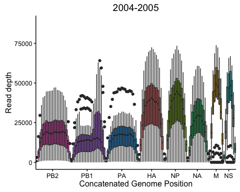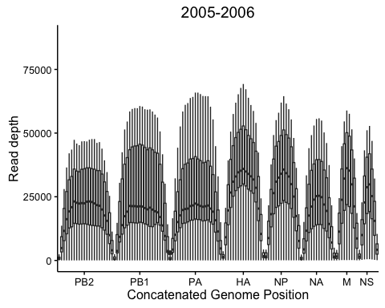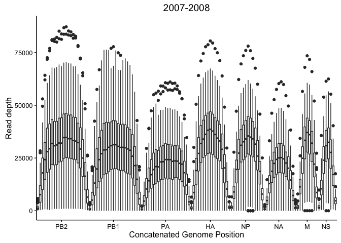

If we plot on a log scale the bars are well above 0.

    ## Scale for 'y' is already present. Adding another scale for 'y', which
    ## will replace the existing scale.

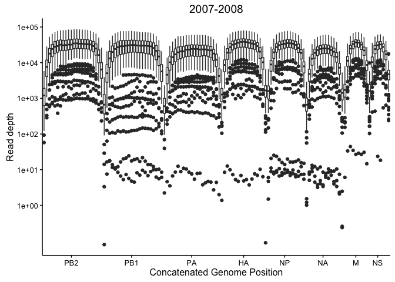

I have made the following figures using just thevariant data from the 2007-2008 season. This constitutes the majority of the sequenced data. If we want to include the other seasons we'll just need to incorporate the HAI and NAI titers and sample day in the meta data. I have only included variants between 1-99% frequency.

Figure 5
========

High quality is &gt;105 or &gt;103 sequenced in duplicate. Currently I am making these plots with just the 2007-2008 samples. Once I have the meta datafor the other seasons it will be trivial to add them (if we want to do that)

Frequency of Variants
---------------------

These are the variants between 1-99%. each bin is 1% wide. The y axis is log scaled which in ggplot leads to a problem when there are no observations (lines below axis). I can remove these before publication. 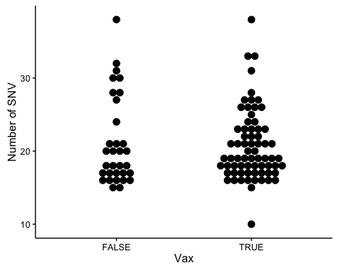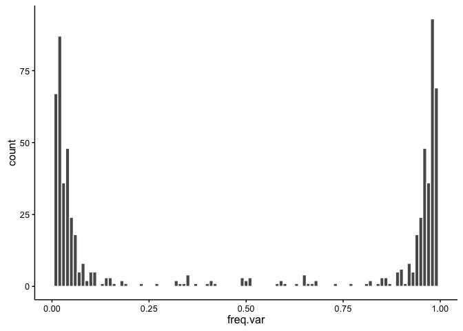

### iSNV

#### By day

    ## `stat_bindot()` using `bins = 30`. Pick better value with `binwidth`.

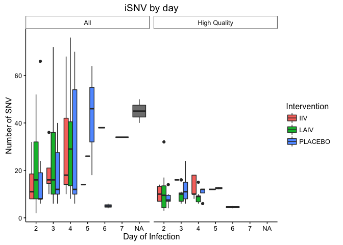

It looks like the iSNV count peaks around day 3 or 4. But I don't know if that's statistically significant or robust.

#### Whole Genome

    ## `stat_bindot()` using `bins = 30`. Pick better value with `binwidth`.

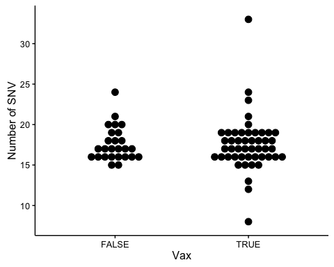

### HA NA

    ## `stat_bindot()` using `bins = 30`. Pick better value with `binwidth`.

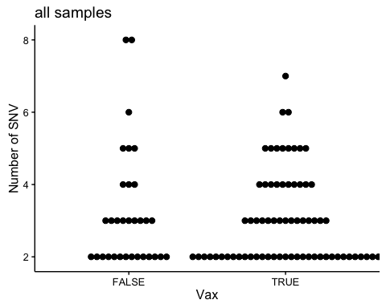

Table 4
=======

Average iSNV/ segment

All data

| chr |   IIV|  LAIV|  PLACEBO|   NA|
|:----|-----:|-----:|--------:|----:|
| HA  |  4.67|  4.21|     5.41|    4|
| M   |  4.33|  5.00|     4.15|   NA|
| NP  |  3.60|  4.67|     5.40|    6|
| NS  |  2.40|  4.10|     3.82|   NA|
| PA  |  6.00|  6.36|     4.89|    2|
| PB1 |  5.80|  6.65|     6.94|   33|
| PB2 |  5.14|  5.52|     5.13|   NA|

Not sure what the NA is we must be missing an intervention for one of the samples.

High quality data

| chr |   IIV|  LAIV|  PLACEBO|
|:----|-----:|-----:|--------:|
| HA  |  2.86|  2.27|     2.50|
| M   |  2.00|  2.00|     2.25|
| NP  |  2.75|  2.33|     2.60|
| NS  |  1.75|  2.50|     2.14|
| PA  |  3.60|  3.40|     3.26|
| PB1 |  4.00|  2.54|     2.27|
| PB2 |  4.09|  3.33|     3.45|

Appendix
========

Extra iSNV groupings
--------------------

### Whole genome

    ## `stat_bindot()` using `bins = 30`. Pick better value with `binwidth`.

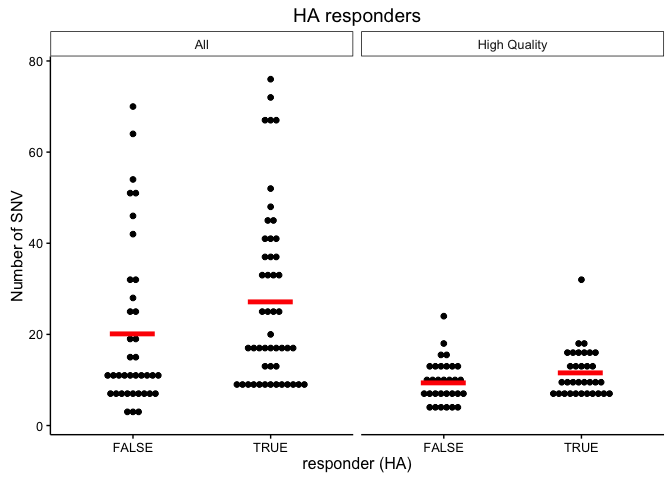

    ## `stat_bindot()` using `bins = 30`. Pick better value with `binwidth`.

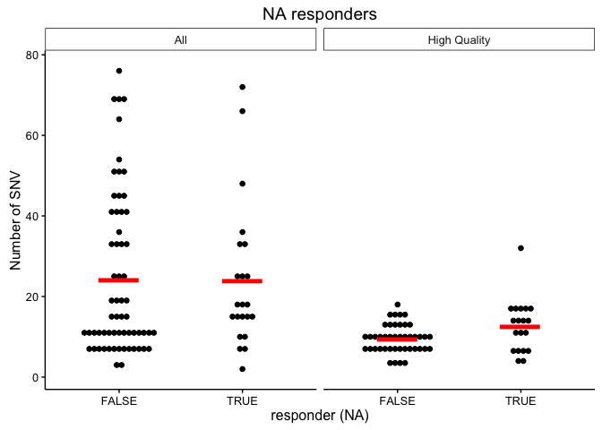

    ## `stat_bindot()` using `bins = 30`. Pick better value with `binwidth`.

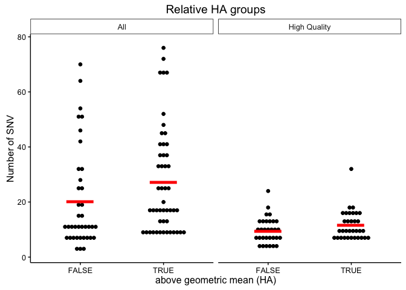

    ## `stat_bindot()` using `bins = 30`. Pick better value with `binwidth`.

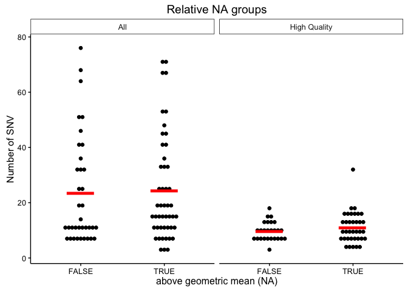

    ## `stat_bindot()` using `bins = 30`. Pick better value with `binwidth`.

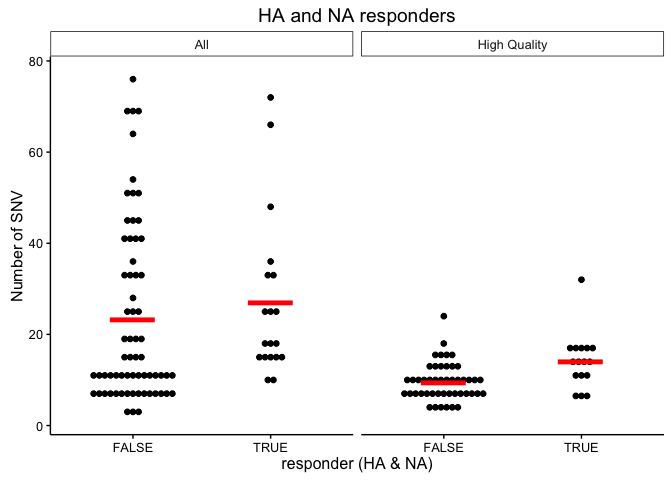

    ## `stat_bindot()` using `bins = 30`. Pick better value with `binwidth`.

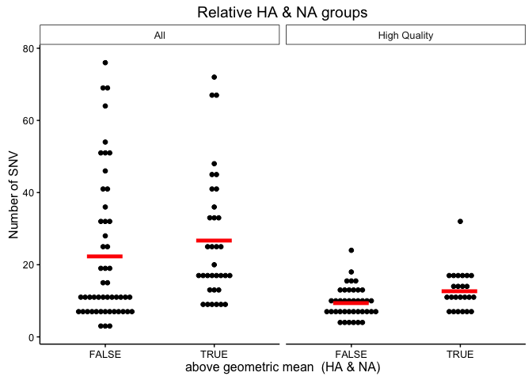

### HA and NA

    ## `stat_bindot()` using `bins = 30`. Pick better value with `binwidth`.

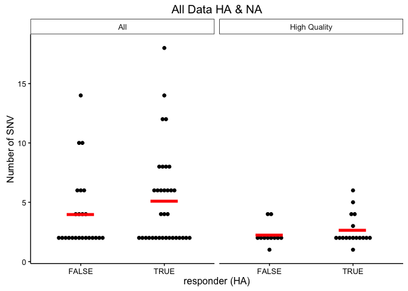

    ## `stat_bindot()` using `bins = 30`. Pick better value with `binwidth`.

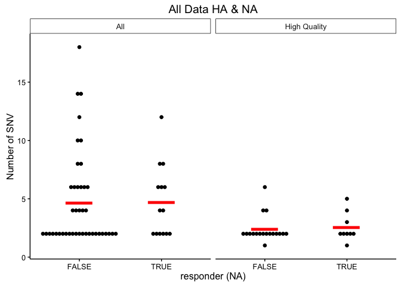

    ## `stat_bindot()` using `bins = 30`. Pick better value with `binwidth`.

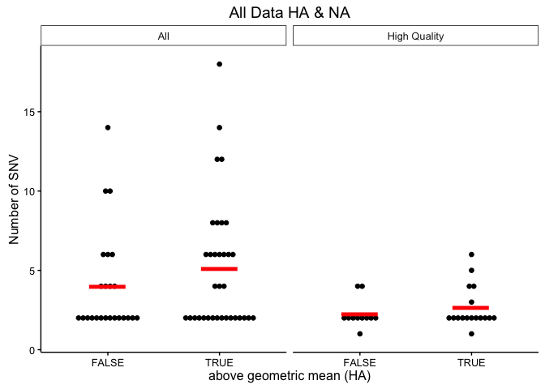

    ## `stat_bindot()` using `bins = 30`. Pick better value with `binwidth`.

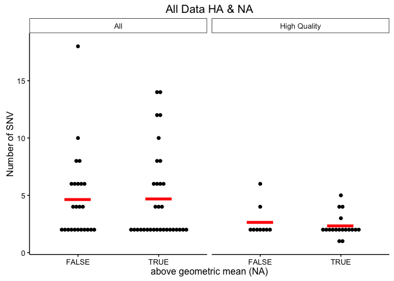

    ## `stat_bindot()` using `bins = 30`. Pick better value with `binwidth`.

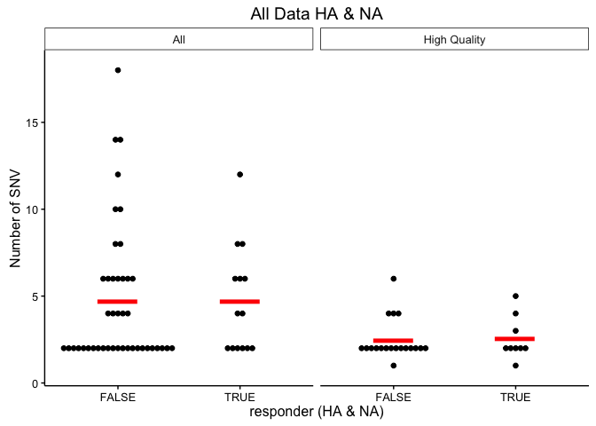

    ## `stat_bindot()` using `bins = 30`. Pick better value with `binwidth`.

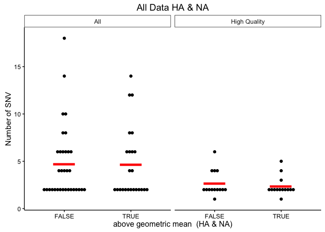
