# Figure 4

High quality is >10^5^ or >10^3^ sequenced in duplicate.
Currently I am making these plots with just the 2007-2008 samples. Once I have the meta datafor the other seasons it will be trivial to add them (if we want to do that) 

## A) Variant Frequencies

These are the variants between 1-50%. each bin is 1% wide. The y axis is log scaled which in ggplot leads to a problem when there are no observations (lines below axis). I can remove these before publication.
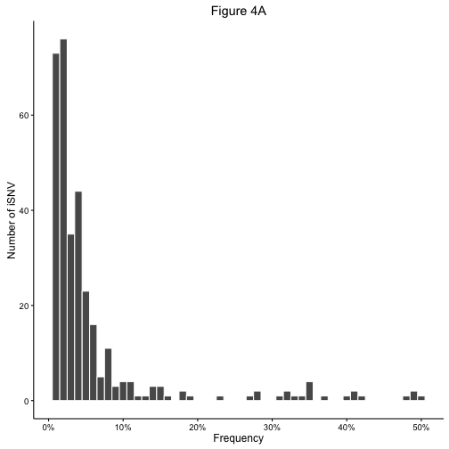

```
## quartz_off_screen 
##                 2
```

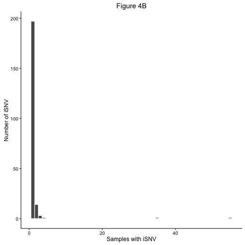

```
## quartz_off_screen 
##                 2
```

The x axis is so large because there are 2 mutations that are found in 55 and 35 samples. Both of these are infered minor variants. They may be artifacts of our analysis.


```
## `stat_bindot()` using `bins = 30`. Pick better value with `binwidth`.
```

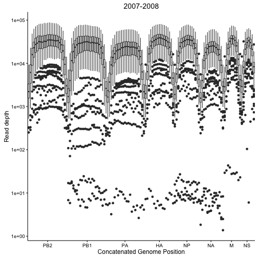

```
## `stat_bindot()` using `bins = 30`. Pick better value with `binwidth`.
```

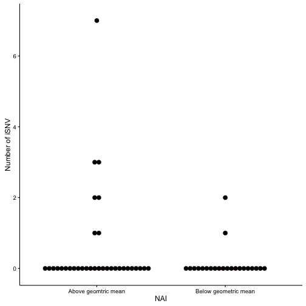


There are very few iSNV in NA. Also I need to account for the samples with no variants in either chr.


# Table 3
Average iSNV/ segment

All data 

|chr |IIV          |LAIV          |PLACEBO       |
|:---|:------------|:-------------|:-------------|
|HA  |1.6 ± (1)    |1.27 ± (0.5)  |1.3 ± (0)     |
|M   |1 ± (0)      |1.14 ± (0)    |1 ± (0)       |
|N_A |1 ± (0)      |1.17 ± (0)    |1.33 ± (0.5)  |
|NP  |2.5 ± (0.5)  |1.33 ± (0.75) |1.25 ± (0.25) |
|NS  |1 ± (0)      |1.33 ± (0.75) |1.29 ± (0.5)  |
|PA  |1.71 ± (0.5) |1.72 ± (1)    |1.7 ± (1)     |
|PB1 |1.67 ± (1)   |1.46 ± (1)    |1.4 ± (0.75)  |
|PB2 |2.29 ± (1.5) |1.78 ± (1)    |1.81 ± (1)    |


#Supplemental Figure 1)

These are just from the first runs. I'm not including the duplicates here - should I? These have a sliding window of 100 with a step of 100 no overlap.

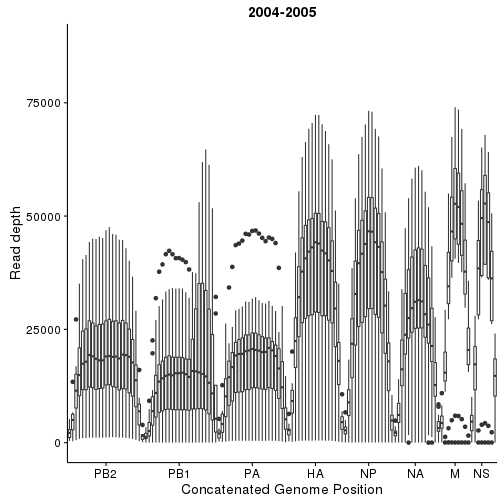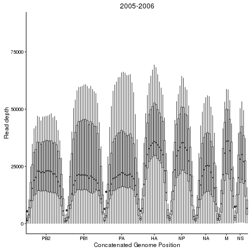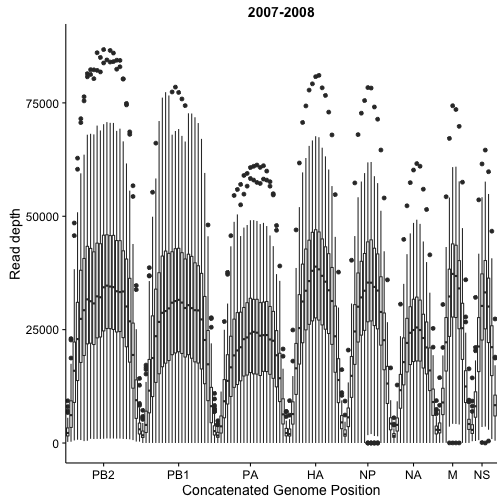

If we plot on a log scale the bars are well above 0. 


```
## Scale for 'y' is already present. Adding another scale for 'y', which
## will replace the existing scale.
```


# Supplemental Figure 2)

```
## `stat_bindot()` using `bins = 30`. Pick better value with `binwidth`.
```

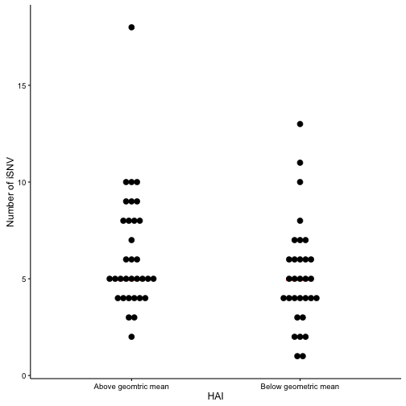

```
## `stat_bindot()` using `bins = 30`. Pick better value with `binwidth`.
```

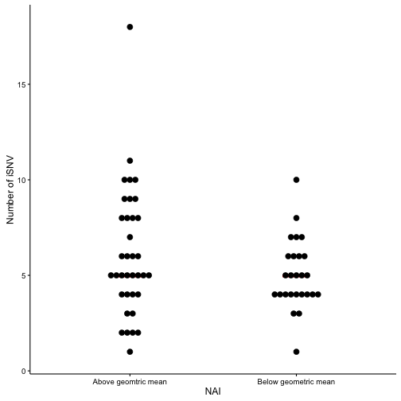


# Appendix
## Linear plots

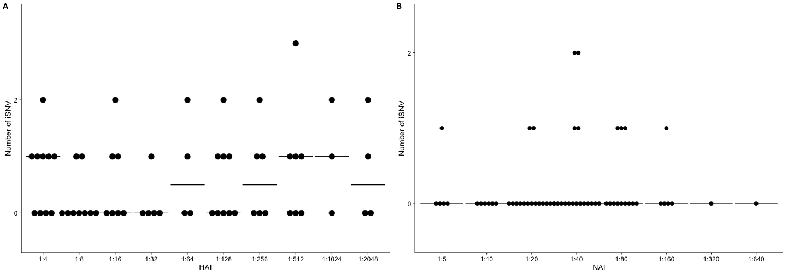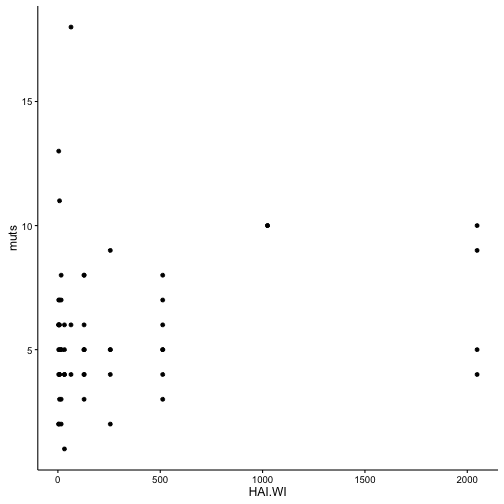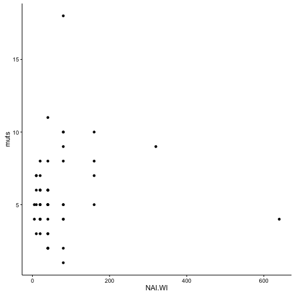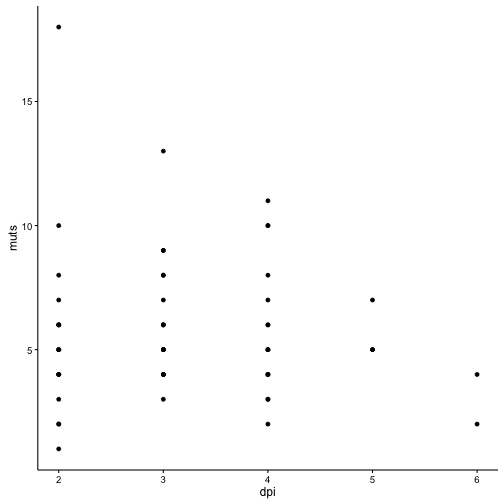

## Linear model with all variables

NB : I'm not sure what I'm doing here and if it's valid.


```
## 
## Call:
## lm(formula = lines.07$muts ~ lines.07$HAI.WI + lines.07$NAI.WI + 
##     lines.07$Copy_num + lines.07$dpi)
## 
## Residuals:
##     Min      1Q  Median      3Q     Max 
## -5.0196 -1.2890  0.1916  1.4498  6.4732 
## 
## Coefficients:
##                     Estimate Std. Error t value Pr(>|t|)    
## (Intercept)        4.461e+00  1.141e+00   3.910 0.000278 ***
## lines.07$HAI.WI    1.382e-03  7.818e-04   1.767 0.083288 .  
## lines.07$NAI.WI   -2.406e-03  4.477e-03  -0.538 0.593275    
## lines.07$Copy_num  5.577e-05  1.356e-05   4.111 0.000146 ***
## lines.07$dpi       9.492e-03  3.209e-01   0.030 0.976518    
## ---
## Signif. codes:  0 '***' 0.001 '**' 0.01 '*' 0.05 '.' 0.1 ' ' 1
## 
## Residual standard error: 2.459 on 50 degrees of freedom
##   (2 observations deleted due to missingness)
## Multiple R-squared:  0.2948,	Adjusted R-squared:  0.2384 
## F-statistic: 5.226 on 4 and 50 DF,  p-value: 0.00135
```

I think this means that maybe the copy number is the only variable that affects the iSNV count. What if we remove the one outlier at 16.

```
## 
## Call:
## lm(formula = no_out.07$muts ~ no_out.07$HAI.WI + no_out.07$NAI.WI + 
##     no_out.07$Copy_num + no_out.07$dpi)
## 
## Residuals:
##     Min      1Q  Median      3Q     Max 
## -5.0196 -1.2890  0.1916  1.4498  6.4732 
## 
## Coefficients:
##                      Estimate Std. Error t value Pr(>|t|)    
## (Intercept)         4.461e+00  1.141e+00   3.910 0.000278 ***
## no_out.07$HAI.WI    1.382e-03  7.818e-04   1.767 0.083288 .  
## no_out.07$NAI.WI   -2.406e-03  4.477e-03  -0.538 0.593275    
## no_out.07$Copy_num  5.577e-05  1.356e-05   4.111 0.000146 ***
## no_out.07$dpi       9.492e-03  3.209e-01   0.030 0.976518    
## ---
## Signif. codes:  0 '***' 0.001 '**' 0.01 '*' 0.05 '.' 0.1 ' ' 1
## 
## Residual standard error: 2.459 on 50 degrees of freedom
##   (2 observations deleted due to missingness)
## Multiple R-squared:  0.2948,	Adjusted R-squared:  0.2384 
## F-statistic: 5.226 on 4 and 50 DF,  p-value: 0.00135
```

Yep. I looks like that was driving things. 

I'll have to think about whether or not this analysis is justified, valid, and needed.


```
## [1] 35 41
```

```
##  [1]  222  234  314  440  700  701  717  758  761  791  883  894  899  909
## [15] 1044 1077 1144 1150 1226 1258 1265 1298 1325 1365 1433 1436 1487 1505
## [29] 1532 1589 1643
```

```
##    chr  pos ref var        p.val   freq.var sigma2.freq.var n.tst.fw
## 1   HA 1150   C   A 7.711945e-18 0.05650363    1.319168e-06   1228.5
## 4   HA  717   A   G 1.758853e-09 0.03442607    1.064026e-06    554.5
## 6   HA  761   C   T 1.078242e-07 0.03350853    1.058548e-06    542.0
## 7   HA 1044   G   A 2.148856e-03 0.01939069    6.879532e-07    324.5
## 10  HA 1325   C   T 1.989188e-18 0.14602505    4.034080e-06   2324.0
## 12  HA 1077   G   T 5.962506e-06 0.01745820    4.661627e-07    413.0
##    cov.tst.fw n.tst.bw cov.tst.bw n.ctrl.fw cov.ctrl.fw n.ctrl.bw
## 1     21531.0   1247.5    22166.0       3.0      7858.5       2.5
## 4     15941.0    583.5    16171.5       0.5      5117.0       0.0
## 6     15834.5    577.0    16410.0       1.0      5095.5       1.5
## 7     15695.5    309.0    15325.0       2.5      5342.5       2.0
## 10    15956.0   3164.0    21673.5       2.5      6125.5       6.0
## 12    21193.5    343.5    20264.0       6.0      8853.5       3.5
##    cov.ctrl.bw    raw.p.val  Id  mutation     MapQ Read_pos    Phred
## 1       8147.0 1.414932e-22 103 HA_C1150A 41.40358 63.30720 37.43589
## 4       5421.0 3.227016e-14  10  HA_A717G 41.13401 63.54923 37.37628
## 6       5518.5 1.978281e-12  10  HA_C761T 41.22268 61.84349 37.53251
## 7       5062.5 3.942566e-08  10 HA_G1044A 41.07675 65.04034 37.48401
## 10      8609.0 3.649619e-23  12 HA_C1325T 41.54948 63.54334 37.48433
## 12      8163.0 1.093957e-10  12 HA_G1077T 41.63811 62.60988 37.39290
##    Copy_num   Vax season Intervention HAI.Uruguay.preseason
## 1     46700  TRUE  8-Jul          IIV                     4
## 4      2850 FALSE  8-Jul      PLACEBO                    64
## 6      2850 FALSE  8-Jul      PLACEBO                    64
## 7      2850 FALSE  8-Jul      PLACEBO                    64
## 10     6180  TRUE  8-Jul         LAIV                     4
## 12     6180  TRUE  8-Jul         LAIV                     4
##    HAI.Uruaguay.30.post.vax HAI.WI.vax.preseason HAI.WI.30.post.vax
## 1                        64                   16                512
## 4                        32                  256                512
## 6                        32                  256                512
## 7                        32                  256                512
## 10                       32                    4                 64
## 12                       32                    4                 64
##    NAI.WI.vax.preseason NAI.WI.30.post.vax
## 1                    20                 40
## 4                    20                 20
## 6                    20                 20
## 7                    20                 20
## 10                   10                 20
## 12                   10                 20
##    Day.of.Infection.sample.collected collection_date total.freq coding.pos
## 1                                  2       12-Mar-08 0.05650363       1121
## 4                                  3       14-Jan-08 0.03442607        688
## 6                                  3       14-Jan-08 0.03350853        732
## 7                                  3       14-Jan-08 0.01939069       1015
## 10                                 2       15-Jan-08 0.99781625       1296
## 12                                 2       15-Jan-08 0.01745820       1048
##    responder.HA responder.NA HAI.geo NAI.geo responder.both geom.both
## 1          TRUE        FALSE    TRUE    TRUE          FALSE      TRUE
## 4          TRUE        FALSE    TRUE   FALSE          FALSE     FALSE
## 6          TRUE        FALSE    TRUE   FALSE          FALSE     FALSE
## 7          TRUE        FALSE    TRUE   FALSE          FALSE     FALSE
## 10         TRUE        FALSE    TRUE   FALSE          FALSE     FALSE
## 12         TRUE        FALSE    TRUE   FALSE          FALSE     FALSE
```


```
## quartz_off_screen 
##                 2
```


It looks like the iSNV count peaks around day 3 or 4. But I don't know if that's statistically significant or robust.

