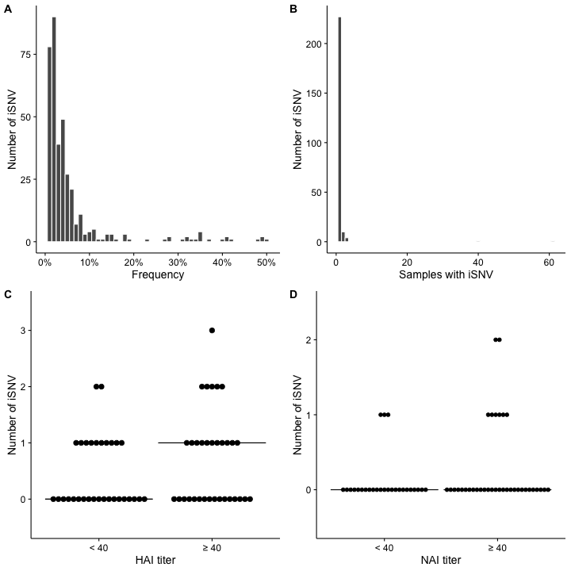
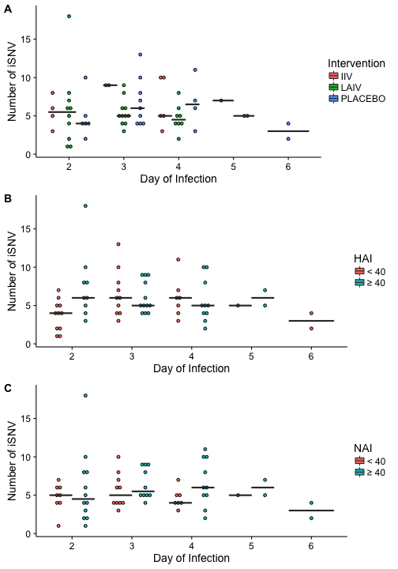
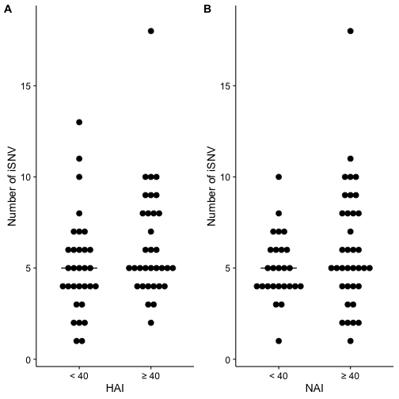
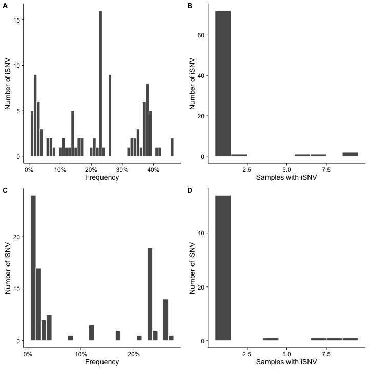

Here verify the average coverage of the sample is >1000


```
## [1] "reading in ../data/processed/Run_1293/deepSNV/all.coverage.csv"
## [1] "appending run column: 1293"
## [1] "reading in ../data/processed/Run_1304/deepSNV/all.coverage.csv"
## [1] "appending run column: 1304"
## [1] "reading in ../data/processed/Run_1412/deepSNV/all.coverage.csv"
## [1] "appending run column: 1412"
## [1] "reading in ../data/processed/2004-2005/deepSNV/all.coverage.csv"
## [1] "appending run column: 2004-5"
## [1] "reading in ../data/processed/2005-2006/deepSNV/all.coverage.csv"
## [1] "appending run column: 2005-6"
## [1] "reading in ../data/processed/2007-2008/deepSNV/all.coverage.csv"
## [1] "appending run column: 2007-8"
```


In the 2007-2008 data set there were 0 samples removed from the the minority analysis based on a mean coverage less than 1000X.

# Figure 3

High quality is >10^5^ or >10^3^ sequenced in duplicate.
Currently I am making these plots with just the 2007-2008 samples. 

These are the variants between 1-50%. each bin is 1% wide. 

```
## png 
##   2
```

```
## png 
##   2
```

```
## Loading required package: cowplot
```

```
## 
## Attaching package: 'cowplot'
```

```
## The following object is masked from 'package:ggplot2':
## 
##     ggsave
```

The x axis is so large because there are 2 mutations that are found in 62 and 41 samples. Both of these are infered minor variants.


```
## png 
##   2
```

```
## png 
##   2
```



There are very few iSNV in NA. 


# Table 3
Average iSNV/ segment

All data 

|chr |< 40 (n=31)  |≥ 40 (n=33) |IIV (n=11)   |LAIV (n=30) |PLACEBO (n=23) |
|:---|:------------|:-----------|:------------|:-----------|:--------------|
|PB2 |1.42 ± (1)   |1.85 ± (1)  |1.91 ± (2)   |1.6 ± (1)   |1.57 ± (1)     |
|PB1 |0.68 ± (1)   |0.7 ± (1)   |0.82 ± (1.5) |0.63 ± (1)  |0.7 ± (1)      |
|PA  |1.39 ± (1)   |1.94 ± (1)  |1.64 ± (1)   |1.7 ± (1)   |1.65 ± (1)     |
|HA  |0.45 ± (1)   |0.73 ± (1)  |0.91 ± (1.5) |0.47 ± (1)  |0.61 ± (1)     |
|NP  |0.39 ± (0.5) |0.3 ± (0)   |0.64 ± (1)   |0.27 ± (0)  |0.3 ± (0)      |
|NR  |0.23 ± (0)   |0.24 ± (0)  |0.27 ± (0.5) |0.23 ± (0)  |0.22 ± (0)     |
|M   |0.29 ± (1)   |0.24 ± (0)  |0.09 ± (0)   |0.27 ± (0)  |0.35 ± (1)     |
|NS  |0.32 ± (0)   |0.33 ± (1)  |0.36 ± (1)   |0.27 ± (0)  |0.39 ± (1)     |


# Figure 4 


```
## png 
##   2
```

```
## png 
##   2
```

```
## png 
##   2
```




#Supplemental Figure 3)

These are just from the first runs. These have a sliding window of 100 with a step of 100 no overlap.


```
## png 
##   2
```

```
## png 
##   2
```

```
## png 
##   2
```

If we plot on a log scale the bars are well above 0. 


So there are a few samples with poor coverage that should be removed from the analysis, but none of them were in the 2007-2008 year.


# Supplemental 5


Diversity by titer


```
## png 
##   2
```

```
## png 
##   2
```


# Supplemental Figure 6)

Genome wide SNV

```
## png 
##   2
```

```
## png 
##   2
```



## Supplemental figure 7 2004-2005 & 2005-2006


```
## png 
##   2
```

```
## png 
##   2
```


```
## png 
##   2
```

```
## png 
##   2
```



# Supplemental tables

## 2004-2005


|chr |< 40 (n=1) |≥ 40 (n=8)    |NA (n=0) |IIV (n=3)    |LAIV (n=4)    |PLACEBO (n=3) |
|:---|:----------|:-------------|:--------|:------------|:-------------|:-------------|
|PB2 |4 ± (0)    |2 ± (1.25)    |3 ± (0)  |1.67 ± (1.5) |2 ± (0.5)     |3.33 ± (0.5)  |
|PB1 |1 ± (0)    |2.75 ± (1.25) |1 ± (0)  |6 ± (8.5)    |1 ± (0.5)     |0.67 ± (0.5)  |
|PA  |3 ± (0)    |2.75 ± (1)    |2 ± (0)  |6.33 ± (9.5) |0.5 ± (1)     |2 ± (1)       |
|HA  |0 ± (0)    |0 ± (0)       |0 ± (0)  |0 ± (0)      |0 ± (0)       |0 ± (0)       |
|NP  |1 ± (0)    |0.88 ± (1.25) |0 ± (0)  |0.67 ± (0.5) |0.75 ± (1.25) |1 ± (1)       |
|NR  |2 ± (0)    |1.12 ± (0)    |2 ± (0)  |1.33 ± (0.5) |1 ± (0)       |1.67 ± (0.5)  |
|M   |1 ± (0)    |1 ± (0)       |0 ± (0)  |2.67 ± (4)   |0 ± (0)       |0.33 ± (0.5)  |
|NS  |0 ± (0)    |0.12 ± (0)    |0 ± (0)  |0.33 ± (0.5) |0 ± (0)       |0 ± (0)       |

## 2005-2006


|chr |< 40 (n=3)   |≥ 40 (n=6)    |IIV (n=6)     |LAIV (n=1) |PLACEBO (n=2) |
|:---|:------------|:-------------|:-------------|:----------|:-------------|
|PB2 |3.33 ± (0.5) |2.67 ± (1)    |2.67 ± (1)    |4 ± (0)    |3 ± (0)       |
|PB1 |0.67 ± (0.5) |0.83 ± (1)    |0.83 ± (1)    |1 ± (0)    |0.5 ± (0.5)   |
|PA  |2 ± (2.5)    |0.33 ± (0.75) |0.33 ± (0.75) |5 ± (0)    |0.5 ± (0.5)   |
|HA  |1.67 ± (2.5) |1.67 ± (0.75) |1.67 ± (0.75) |5 ± (0)    |0 ± (0)       |
|NP  |1.67 ± (0.5) |0.67 ± (1)    |0.67 ± (1)    |1 ± (0)    |2 ± (0)       |
|NR  |1.33 ± (0.5) |1.83 ± (1)    |1.83 ± (1)    |1 ± (0)    |1.5 ± (0.5)   |
|M   |0.33 ± (0.5) |0.33 ± (0.75) |0.33 ± (0.75) |0 ± (0)    |0.5 ± (0.5)   |
|NS  |0.33 ± (0.5) |0.5 ± (0)     |0.5 ± (0)     |0 ± (0)    |0.5 ± (0.5)   |


