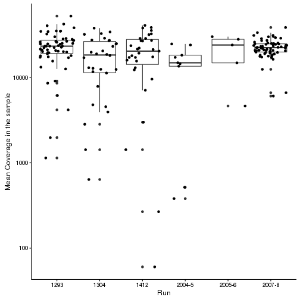
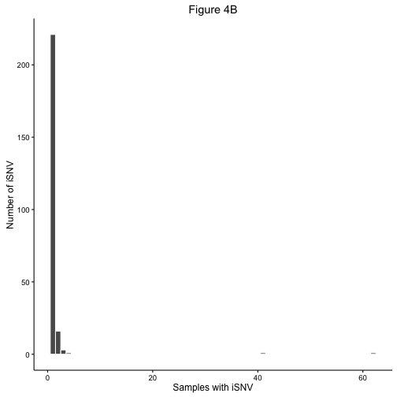
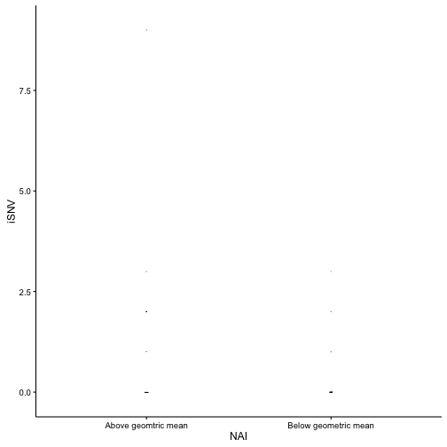

# Figure 4

High quality is >10^5^ or >10^3^ sequenced in duplicate.
Currently I am making these plots with just the 2007-2008 samples. Once I have the meta datafor the other seasons it will be trivial to add them (if we want to do that) 

## A) Variant Frequencies

These are the variants between 1-50%. each bin is 1% wide. The y axis is log scaled which in ggplot leads to a problem when there are no observations (lines below axis). I can remove these before publication.


```
## quartz_off_screen 
##                 2
```



```
## quartz_off_screen 
##                 2
```

The x axis is so large because there are 2 mutations that are found in 55 and 35 samples. Both of these are infered minor variants. They may be artifacts of our analysis.


```
## `stat_bindot()` using `bins = 30`. Pick better value with `binwidth`.
```


```
## `stat_bindot()` using `bins = 30`. Pick better value with `binwidth`.
```




There are very few iSNV in NA. Also I need to account for the samples with no variants in either chr.


# Table 3
Average iSNV/ segment

All data 

|chr |IIV           |LAIV          |PLACEBO       |
|:---|:-------------|:-------------|:-------------|
|HA  |1.43 ± (1)    |1.27 ± (0.5)  |1.27 ± (0)    |
|M   |1 ± (0)       |1.14 ± (0)    |1 ± (0)       |
|NP  |1.75 ± (1.25) |1.33 ± (0.75) |1.4 ± (1)     |
|NR  |1 ± (0)       |1.17 ± (0)    |1.25 ± (0.25) |
|NS  |1 ± (0)       |1.33 ± (0.75) |1.29 ± (0.5)  |
|PA  |1.8 ± (0.75)  |1.7 ± (1)     |1.65 ± (1)    |
|PB1 |1.8 ± (1)     |1.46 ± (1)    |1.45 ± (1)    |
|PB2 |2.1 ± (2)     |1.78 ± (1)    |1.89 ± (1)    |


#Supplemental Figure 1)

These are just from the first runs. I'm not including the duplicates here - should I? These have a sliding window of 100 with a step of 100 no overlap.


If we plot on a log scale the bars are well above 0. 


```
## Scale for 'y' is already present. Adding another scale for 'y', which
## will replace the existing scale.
```


# Supplemental Figure 2)

```
## `stat_bindot()` using `bins = 30`. Pick better value with `binwidth`.
```


```
## `stat_bindot()` using `bins = 30`. Pick better value with `binwidth`.
```


# Appendix
## Linear plots


```
## Error in subset(data.df, freq.var <= 0.5): object 'qual.2007.8' not found
```

```
## Error in ggplot(lines.07, aes(y = muts, x = Copy_num)): object 'lines.07' not found
```

```
## Error in ggplot(lines.07, aes(y = muts, x = HAI.WI)): object 'lines.07' not found
```

```
## Error in ggplot(lines.07, aes(y = muts, x = NAI.WI)): object 'lines.07' not found
```

```
## Error in ggplot(lines.07, aes(y = muts, x = dpi)): object 'lines.07' not found
```

## Linear model with all variables

NB : I'm not sure what I'm doing here and if it's valid.


```
## Error in eval(expr, envir, enclos): object 'lines.07' not found
```

```
## Error in summary(model): object 'model' not found
```

I think this means that maybe the copy number is the only variable that affects the iSNV count. What if we remove the one outlier at 16.

```
## Error in subset(lines.07, muts != 16): object 'lines.07' not found
```

```
## Error in eval(expr, envir, enclos): object 'no_out.07' not found
```

```
## Error in summary(model.no): object 'model.no' not found
```

Yep. I looks like that was driving things. 

I'll have to think about whether or not this analysis is justified, valid, and needed.


```
## Error in subset(df, freq.var <= 0.5): object 'qual.2007.8' not found
```

```
## Error in rbind(qual.isnv.day, data.frame(Id = rep("extra", 3), Day.of.Infection.sample.collected = c(5, : object 'qual.isnv.day' not found
```

```
## Error in ggplot(data = qual.isnv.day, aes(y = iSNV, x = as.factor(paste(Day.of.Infection.sample.collected, : object 'qual.isnv.day' not found
```

```
## Error in eval(expr, envir, enclos): object 'iSNV.day' not found
```

```
## quartz_off_screen 
##                 2
```


It looks like the iSNV count peaks around day 3 or 4. But I don't know if that's statistically significant or robust.

